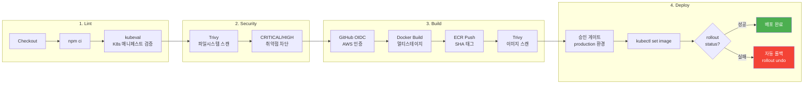
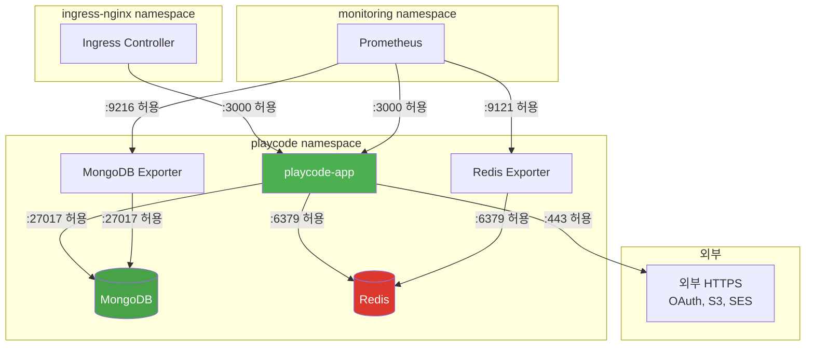
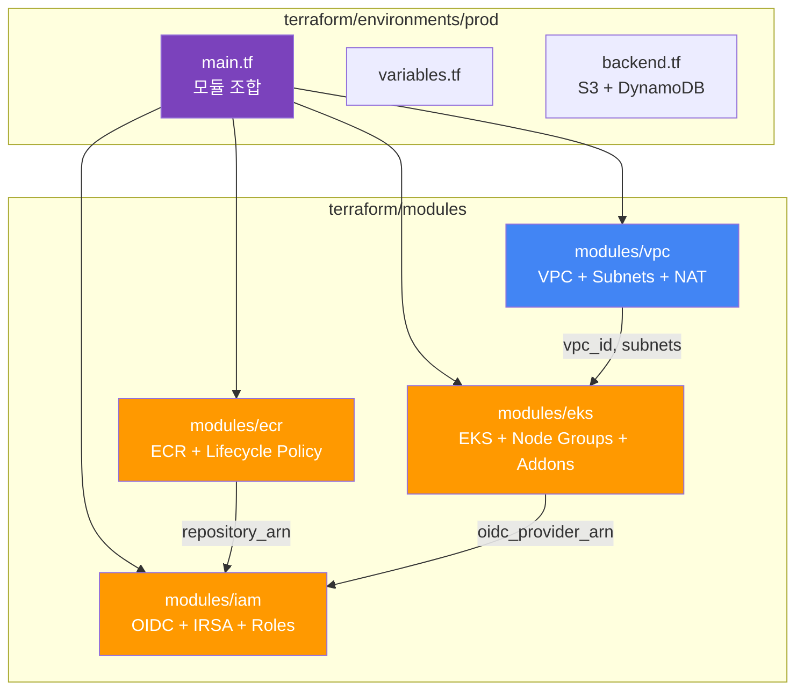

# PlayCode.gg 인프라 아키텍처

## 전체 인프라 구조

```mermaid
graph TB
    subgraph "사용자"
        USER[브라우저/클라이언트]
    end

    subgraph "DNS & CDN"
        DNS[Route 53<br/>playcode.gg]
    end

    subgraph "AWS VPC (10.0.0.0/16)"
        subgraph "Public Subnet"
            NAT[NAT Gateway]
        end

        subgraph "EKS Cluster"
            subgraph "ingress-nginx namespace"
                INGRESS[NGINX Ingress Controller<br/>+ Let's Encrypt TLS]
            end

            subgraph "playcode namespace"
                subgraph "Application"
                    APP1[playcode-app Pod 1<br/>Node.js]
                    APP2[playcode-app Pod 2<br/>Node.js]
                    HPA[HPA<br/>min:2 / max:4<br/>CPU 70% / Mem 80%]
                end

                subgraph "Database"
                    MONGO[(MongoDB 7<br/>StatefulSet<br/>PVC 10Gi)]
                    REDIS[(Redis 7<br/>AOF 영속성<br/>PVC 2Gi)]
                end

                subgraph "Exporters"
                    MONGO_EXP[MongoDB Exporter]
                    REDIS_EXP[Redis Exporter]
                end

                BACKUP[MongoDB Backup<br/>CronJob 매일 3AM KST]
            end

            subgraph "monitoring namespace"
                PROM[Prometheus<br/>메트릭 수집 15s]
                GRAFANA[Grafana<br/>대시보드 3개]
                LOKI[Loki<br/>로그 수집]
                PROMTAIL[Promtail<br/>DaemonSet]
            end
        end
    end

    subgraph "AWS Services"
        ECR[ECR<br/>컨테이너 레지스트리]
        S3_UPLOAD[S3<br/>이미지 업로드]
        S3_BACKUP[S3<br/>DB 백업]
        S3_TF[S3<br/>Terraform State]
        SES[SES<br/>이메일 발송]
    end

    subgraph "CI/CD"
        GH[GitHub<br/>main 브랜치]
        GHA[GitHub Actions<br/>4단계 파이프라인]
    end

    subgraph "External OAuth"
        NAVER[네이버 OAuth]
        GOOGLE[구글 OAuth]
    end

    USER -->|HTTPS| DNS
    DNS --> INGRESS
    INGRESS -->|HTTP :3000| APP1
    INGRESS -->|HTTP :3000| APP2
    HPA -.->|오토스케일링| APP1
    HPA -.->|오토스케일링| APP2

    APP1 & APP2 -->|TCP :27017| MONGO
    APP1 & APP2 -->|TCP :6379| REDIS
    APP1 & APP2 -->|WebSocket| REDIS
    APP1 & APP2 -->|Presigned URL| S3_UPLOAD
    APP1 & APP2 -->|SMTP| SES
    APP1 & APP2 -->|OAuth 2.0| NAVER & GOOGLE

    MONGO_EXP -->|:27017| MONGO
    REDIS_EXP -->|:6379| REDIS
    BACKUP -->|mongodump| MONGO
    BACKUP -->|업로드| S3_BACKUP

    PROM -->|/metrics :3000| APP1 & APP2
    PROM -->|:9216| MONGO_EXP
    PROM -->|:9121| REDIS_EXP
    GRAFANA -->|쿼리| PROM
    GRAFANA -->|쿼리| LOKI
    PROMTAIL -->|로그 수집| LOKI

    GH -->|push main| GHA
    GHA -->|빌드+푸시| ECR
    GHA -->|SSH 배포| APP1 & APP2

    style APP1 fill:#4CAF50,color:#fff
    style APP2 fill:#4CAF50,color:#fff
    style MONGO fill:#47A248,color:#fff
    style REDIS fill:#DC382D,color:#fff
    style PROM fill:#E6522C,color:#fff
    style GRAFANA fill:#F46800,color:#fff
    style LOKI fill:#F46800,color:#fff
```

## CI/CD 파이프라인

## 네트워크 정책 (제로트러스트)

## Terraform 모듈 구조

## 모니터링 대시보드

| 대시보드 | 주요 메트릭 |
|---------|------------|
| **Application** | HTTP 처리율, 응답 지연시간 (p50/p95/p99), WebSocket 연결 수, 게임 세션/플레이어 수, 인증 시도, Node.js 힙/이벤트루프 |
| **Infrastructure** | Pod CPU/메모리, 재시작 횟수, HPA 레플리카, 네트워크 I/O, 디스크 사용량, 노드 리소스 |
| **Database** | MongoDB 연결/작업율/메모리/스토리지, Redis 메모리/연결/명령율/히트율, 앱 쿼리 지연시간 |
